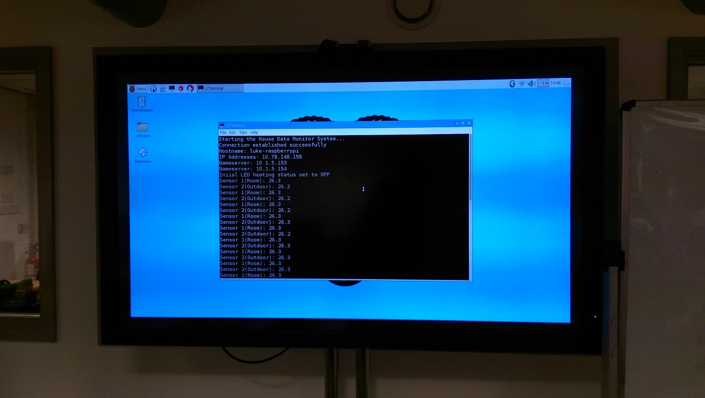

# House Temperature Control System using Raspberry PI and Java

## Contents

1. Project Description   
2. System Look (software)  
3. System Look (hardware)  
4. The Repository  
5. What Went Wrong
6. What I Have Learned
7. Future Development  
8. Help  

## 1. Project Description 
Date of the project: 04/2017   
The project tries to solve a problem of not being able to control a house temperature when householders are away.

The project undertaken on controlling a house temperature using Raspberry Pi and Java remotely involves many aspects, from software design, implementation and testing, to hardware components and their assembling, making a physical model, and building a MySQL database for storing and passing retrieved measurements. 

The complete system consists of:
-	the  user GUI program running on a PC
-	a database (for data transmission and storage)
-	Raspberry Pi with 2 waterproof sensors (one for measuring room temperature, one for outdoor temperature) and a LED (to mimic heating)
-	the device program running on Raspberry Pi

The user GUI program main functionality is to:
-	retrieve sensor data from database in real time
-	set heating status
-	display data on Time Series Chart, Bar Chart (created using Strategy design pattern)
-	control heating using three core options:  
    o MANUAL   
    o SEMI AUTO  
    o FULL AUTO  

The device program main functionality is to:
-	retrieve sensor data and send them to a database
-	turn ON/OFF LED based on retrieved heating status from the database

The system is different to other existing systems, as it:
-	has a sensor for reading outdoor temperatures (instead of relying on weather forecast from the Internet, improving accuracy)
-	displays real-time temperatures not only in fields, but also on charts

## 2. System Look (software)

### 2.1 Device Program running

### 2.2 User GUI v1.6 running

### 2.3 User GUI v1.6 FULL AUTO option

### 2.4 User GUI v1.6 About

### 2.5 User GUI v1.7 running on Linux Ubuntu

### 2.6 User GUI v1.7 - MANUAL heating option set

### 2.7 User GUI v1.7 SEMI AUTO heating option set

### 2.8 User GUI v1.7 FULL AUTO heating option set

### 2.9 User GUI v1.7 About --> Info

## 3. System Look (hardware)

### 3.1 Complete hardware setup

### 3.2 Hardware with LED On

### 3.3 Testing waterproof sensors

## 4. The Repository  
The repository consists of:
-   deviceProgram - the Device program (to be implemented on Raspberry Pi)
-   userGUIprogram - the User GUI program (to be implemented on a remote computer)
-   systemPictures - pictures of the working system
-   database - a database file (*.sql) for further implementation in your database
-   other - the system's Use Case Diagram, UML diagram, full system overview diagram, Fritzing hardware model (including Raspberry Pi 2 Model B, two DS18B20 waterproof temperature sensors (with a 4.7kΩ resistor), and red LED(with a 330Ω resistor))
-   bashScriptForRaspberryPi - a bash script required for an automated loading of the Device Program without human interaction, executed straight after the Raspbian GUI is loaded
-   externalLibraries - JUnit 4.12 (for the system's testing), MySQL Connector Java 5.1.23 (for JDBC connectivity with a remote MySQL database), JFreeChart 1.0.19 (for displaying data on charts), Pi4J 1.1 (for software-hardware communication with RaspberryPi GPIO, waterproof sensors and the LED) 
    
## 5. What Went Wrong
- more testing should be done, especially using JUnit 
- too much code in some of the Java classes
- lack of temperature calibration on both sensors
- very fragile hardware wire connection
- design patterns implemented in the middle of the system development process instead of at the very beginning of the development process, which would save effort of code refactoring in a further development phases
- the Raspbian should run only with a command line interface (CLI), saving processing power, improving speed and reilability of the system.

## 6. What I Have Learned
- creating GUI in Java without a GUI Builder
- use of Java libraries (JDBC - for database connection, Pi4J - for software-hardware communication, JUnit - for testing, JFreeChart - for displaying data charts in Java)
- utilisation of Strategy and State design patterns
- designing a hardware model using Fritzing hardware design tool
- how to make a bi-directional software-hardware communication in Java
- how to design and connect with a database used by two programs simultaneously
- creating and managing Amazon Web Services EC2 micro instance
- installation and operations on Raspbian Jessie Linux
- writing a bash script and implementing it to automate establishing internet connection and start of the program to read sensors' data

    
## 7. Future Development  
In terms of future development, there are many aspects that can be considered. First of the things might be to calibrate the temperature readings, to make sure the correct values are measured. 

Moreover, the system could incorporate additional sensors, such as humidity, pressure, smoke, and cameras, that would control a whole house and alarm its users by sending a short text message.

Another important improvement would be to incorporate security, and make sure that the system is not easily achievable by other machines connected to the Internet. This would involve penetration testing that would need to be conducted, to show the system vulnerabilities.

Also, an additional system could be created, to analyse data or link the database to some kind of software to analyse them, such as IBM Watson. This would make the system absolutely priceless, and would open the door for future utilisation of the system.

Finally, a complete implementation of Strategy and State patterns would be implemented, to make the system more elastic for changes. Therefore, there would not be a very difficult problem to implement other types of sensors in the future.

## 8. Help   
To reach a full system functionality the below steps are required:
-   pre-installed NetBeans 8.1 to open project (preferably)
-   implementation of a Device Program on Raspberry Pi
-   implementation of a User GUI Program on a PC with pre-installed Java Virtual Machine (JVM)
-   created database and linked to both programs (manually so far)
-   complete setup of Raspberry Pi including connected waterproof sensors and added their Device IDs to the Device Program (manually so far)  
   
 
Please do not hesitate to contact me on the below e-mail if you encounter any problems or need further information.
Contact: <b>lukaszbol[at]yahoo[dot]co[dot]uk</b>
